# Task 1 - 15 most used git commands.
## Global configuration settings, user name and user email.
Setting the username and email will make sure that our vscode knows where to push the changes, which repo we are referring to and which account on github we want all our work to be synced at.
```
git config --global user.name "PratyushMalik"
git config user.name
git config --global user.email "pratyush0410@gmail.com"
git config user.email

```
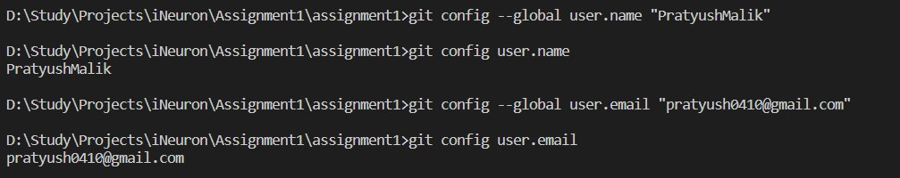

## Initializing repo
We need to initialize a new repository now. We can either create a new repository from github account and clone it here or create a new repository here using the following command line and link it to our account. In our case, we already have a repository created and cloned, therefore this command will just reinitialize the repository.
```
git init
```
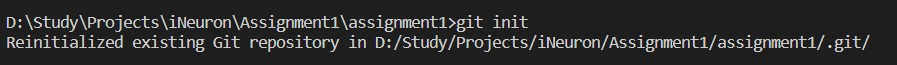

## Adding/Staging the changes
Once the repo is initialized, we need to stage these changes in order to further commit them. We'll add all the files in our working directory to the staging area. We can also add specific files to the staging area using file_name instead of ".". In order to see what our code did, we will check the status afterwards.
```
git add .
git add file_name
git status
```
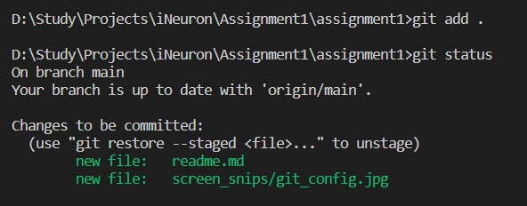

## Committing changes
After the changes are staged temporarily (meaning, it can be unstaged), we can decide to permanently create a snapshot of this stage so that it can further pushed to out remote repo and the snapshot will be saved such that everything (when,where,what changed) is logged properly.
```
git commit -m "readme.md and few snips"
```
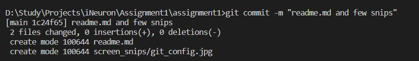

## Adding + Committing changes.
As we keep modifying our files, we can simply use this to add and commit simultaneously. This will only affect the modified files and will not add or commit new/untracked files.
```
git commit -a -m "add and commit together"
```
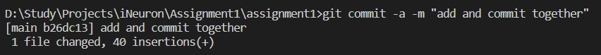

## Create origin branch or link local repo to remote github account
To sync our local repo to our github account, we need to create a remote branch and link to that origin branch. This branch will be the connection between our local machine and remote github account. Because we cloned our remote repository to local machine, we don't need to do this.
```
git remote -v
git remote add origin https://github.com/PratyushMalik/assignment1.git
```

## Push changes to repo
Once committment is done, we will push it to remote repo so that we can see it in out github account. From our local branch, we will push it to our main branch. In case we are working in a different branch other than main branch, then we must merge branch instead of pushing changes.
In the case of first push, we need to authorize our local machine with the github account api. For this,we will use "-u" while pushing changes. After that, we don't need "-u" again.
A window will pop up for signing into your account. You can either use your username and password or a Personal Access Token.
```
git push -u origin main
```
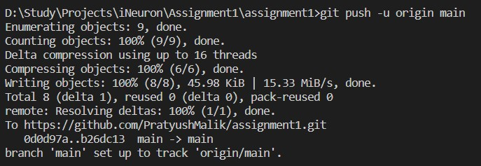

## History log check
In order check out previous commands or events, we can use this log command to see a detailed description of all past events.
```
git log
```
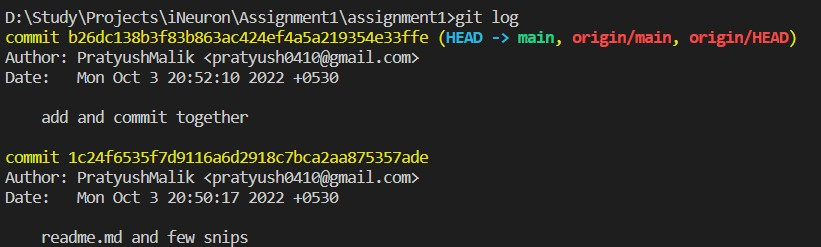

To check differences in each file, we can use this
```
git log -p
```
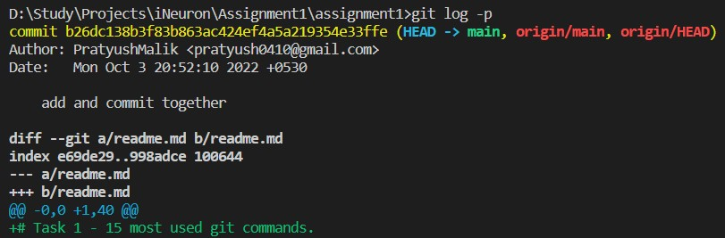

And, to check an overview of the changes, we can use the following
```
git log --stat --summary
```
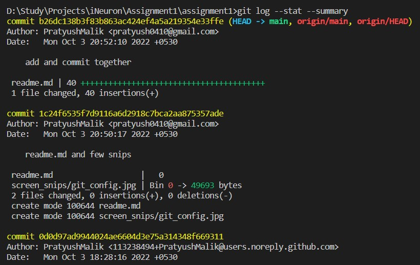

## Check available branches
Use this to check current working branch and available switchable branches. The "*" denotes current branch.
```
git branch
```
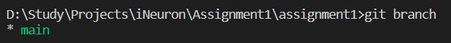

## Create and switching branches
Use the following to create a branch and make it your working branch. Switch and checkout commands can be used here.
```
git branch my_branch
git switch my_branch
```
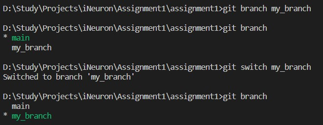

We can also switch to a new branch that doesn't exist yet. The creation takes place simultaneously while switching.

```
git checkout -b new_branch
```
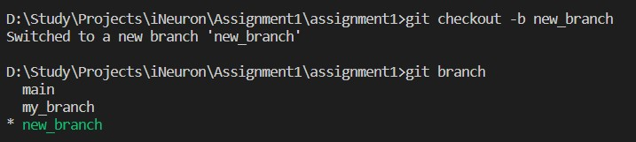

## Merge branches
Once the changes are made to the branch, we can merge the branch into the main branch so that the changes will be reflected in the main branch. Switch to the main branch first and then merge.
```
git switch main
git merge new_branch
git merge my_branch
```